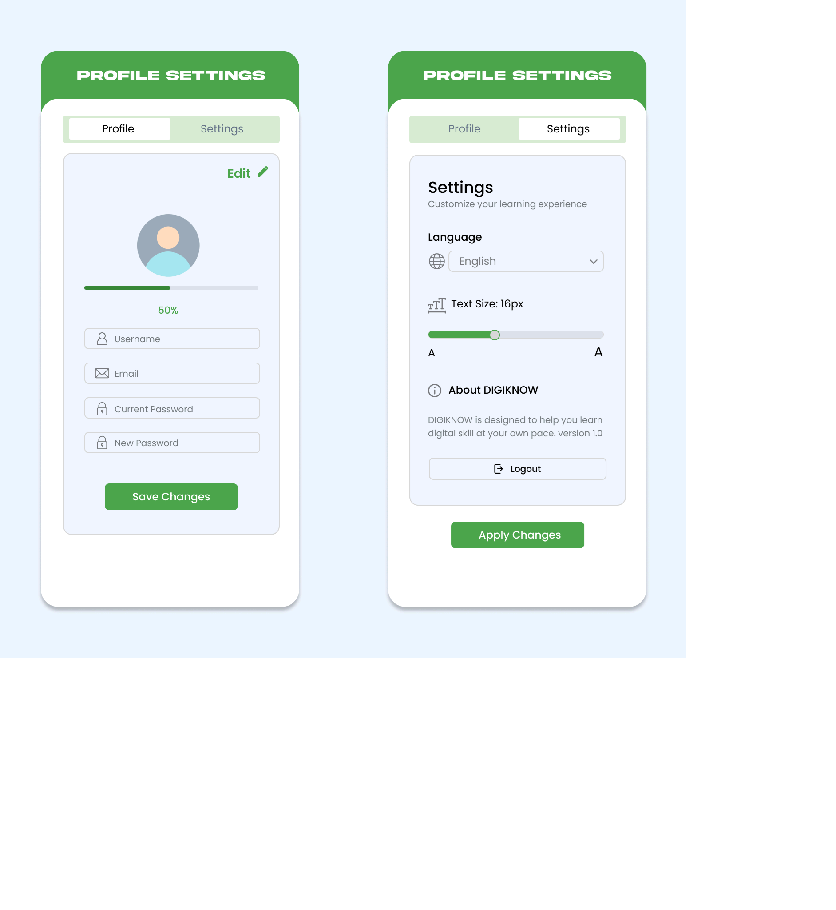
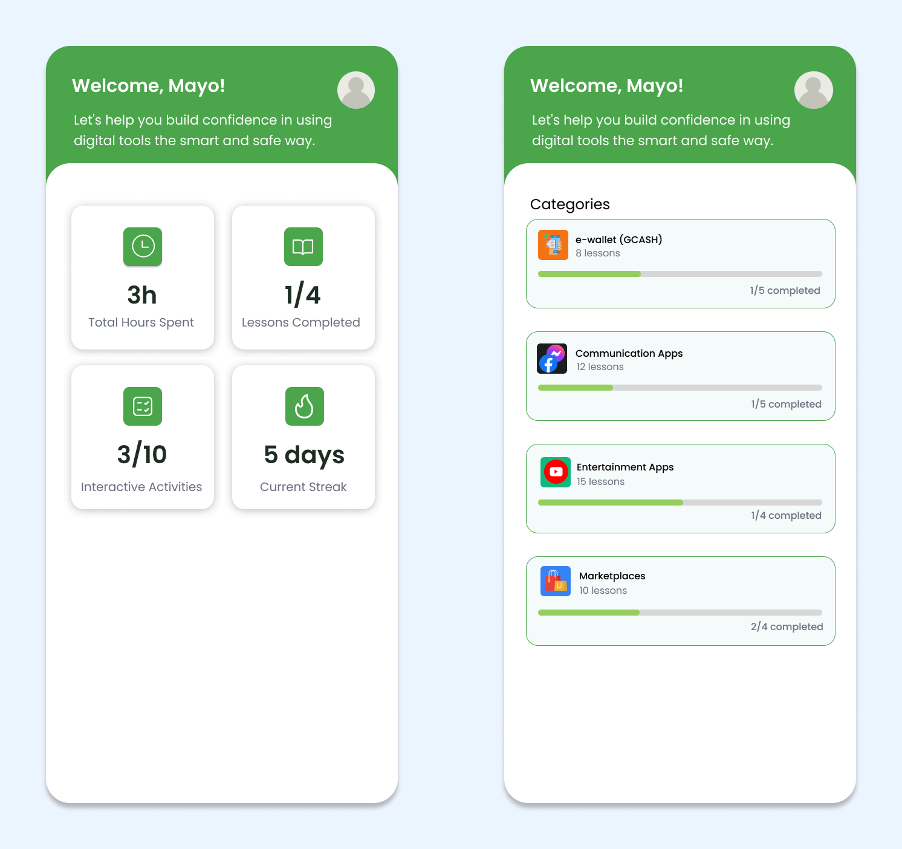

# Hadji Osoph – Project Portfolio 

## About Me
**I am Insan M. Hadji Osoph,** a **BS Information Technology** student at **New Era University**. I am more interested 
in design, especially using tools like Figma and creating user-friendly interfaces, and I also enjoy editing and 
exploring creative ideas. I am still building my experience, but I am continuously learning and improving my 
skills in both design and development.

---

## Featured Projects

- DIGIKNOW A: Mobile Learning Tool for Baby Boomers
and Individuals with Limited Digital Experience

---

### Key Features:
- Login and Sign Up system
- Email tutorial 
- Dashboard with progress tracking
- Interactive learning modules
- Profile and settings
- Suggestion/feedback panel

---

### Learning Modules:
- Digital Wallet (GCash) 
- Communication Apps (Facebook & Messenger)
- Entertainment Apps (YouTube) 
- Online Shopping (Shopee, Lazada, TikTok Shop)

---

## Other Projects
- PISCES (Figma Web & Mobile Design)
- HTML, CSS web projects
- Kotlin (Android Studio apps) 
- Cybersecurity basics
- C++, Python, Dash applications

---

## Screenshots

### Profile Settings

### Dashboard and Categories Learning

### User Interface

---

## Goals
- To create an easy-to-use mobile app for beginners and baby boomers
- To make digital learning simple and guided through step-by-step lessons
- To help users build confidence in using digital tools and applications
