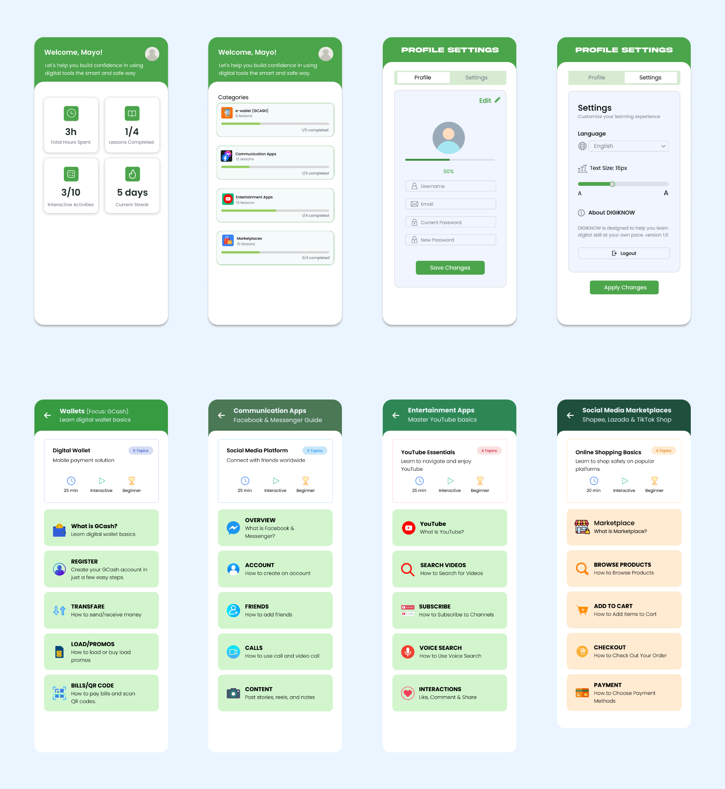

# Hadji Osoph – Project Portfolio 🚀

## About Me
**I am Insan M. Hadji Osoph,** a **BS Information Technology** student at **New Era University**. I am more interested 
in design, especially using tools like Figma and creating user-friendly interfaces, and I also enjoy editing and 
exploring creative ideas. I am still building my experience, but I am continuously learning and improving my 
skills in both design and development.

---

## 📂 Featured Projects

- ** DIGIKNOW A: Mobile Learning Tool for Baby Boomers
and Individuals with Limited Digital Experience

---

### Key Features:
- **Login and Sign Up system
- **Email tutorial 
- **Dashboard with progress tracking
- **Interactive learning modules
- **Profile and settings
- **Suggestion/feedback panel

---

### Learning Modules:
- **Digital Wallet (GCash) 
- **Communication Apps (Facebook & Messenger)
- **Entertainment Apps (YouTube) 
- **Online Shopping (Shopee, Lazada, TikTok Shop)

---

## Other Projects
- Kotlin (Android Studio apps)  
- ReactJS, HTML, CSS web projects  
- C++, Python, Dash applications
- Cybersecurity basics

---

## Screenshots

---

## 🎯 Goals
- Help beginners use technology
- Make digital learning simple and easy 
- Build users’ confidence in using apps
